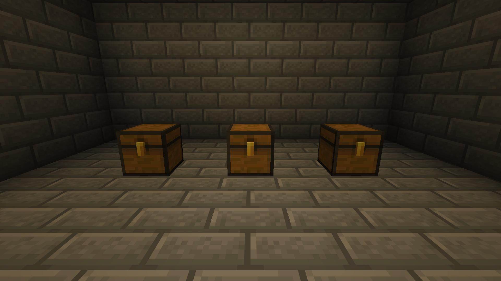
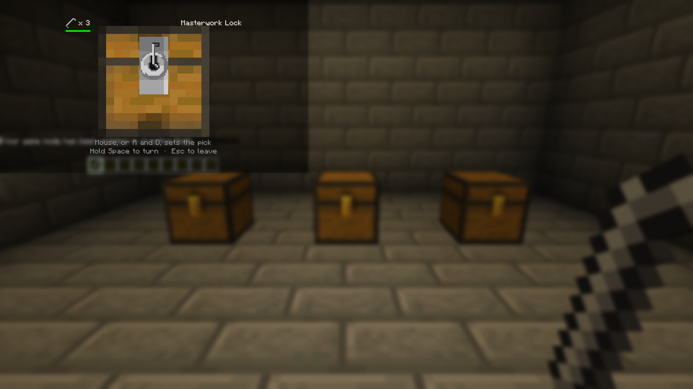

# Loot Ender

A Minecraft Fabric mod. Structure loot is rolled per player, so nobody arrives second.

## Screenshots

## What This Mod Does

The first player to reach a dungeon chest empties it and everyone behind them finds a box of air. That turns exploring together into a race, and a race nobody agreed to enter.

Here, opening a loot chest opens **your** copy of it. The block itself is never unpacked: its loot table stays on it, unrolled, forever. What you take comes out of a copy made the first time you opened it, so the next player still gets a first look, and so does the one after that.

Everything else is vanilla. The chest is the same block, in the same place, with the same lid animation and the same sound. You walk up and open it.

## The One New Thing To Look At

The clasp on the front. A loot chest wears a gold one until you have emptied it, so it can be picked out from the chests around it before anybody opens it.

What vanilla can no longer tell you, once loot is per player, is that **you** have nothing left in this one. So a chest you have emptied wears a darkened clasp instead. Nothing hovers, nothing glows; the clasp just reads as spent from across a room.

Both marks are drawn by Pandorical. A client without it sees ordinary chests everywhere and loses nothing but the reminder.

## What Counts As A Loot Chest

A chest or barrel that still carries an unrolled loot table, which is how the game ships every naturally generated one.

**A chest minecart too.** The one in a mineshaft is the same promise in a different shape, and arriving second at one is the same disappointment. A cart is an entity rather than a block, its table hangs off the vehicle, and vanilla unpacks it on the first look - so it takes its own handling, but from the outside it behaves exactly like the chest in the ground.

A chest you have been keeping wheat in is not a loot chest and never becomes one. Neither is a double chest with a table on only one half, which is a shape this mod does not claim to understand: both fall through to vanilla, untouched. Refusing the cases it is unsure of is the whole safety story, because the worst thing it could do is stand between you and an ordinary chest.

## Details Worth Knowing

- **Your roll is stable.** It is seeded from the chest's own seed, your UUID, and the position. Reopening a chest you have not taken from shows the same contents.
- **Two players get different loot.** Same chest, different rolls, because identical chests read as fake.
- **You can take, not put.** A copy that accepted items would be a private chest at every dungeon in the world, and a promise to remember an inventory per player per chest forever. Taking is all these are for.
- **Half-emptied chests persist.** Leave three things behind, come back next week, they are still there. Yours.
- **Emptied ones stop being inventories.** Once a copy runs out it is thrown away and only the position is kept, because the one question left about it has the answer no. Since copies only ever shrink, that is where nearly all of them end up: one number instead of 27 slots.
- **Double chests behave.** Two copies joined into one 54-slot menu, in the same order vanilla uses, so it does not matter which half you clicked.
- **Only an op can break one.** Breaking a loot chest used to roll its table once, onto the ground, for whoever swung first, and take everyone else's copy with it. So anyone else gets told no, explosions leave loot chests standing, and a chest minecart with loot aboard takes no harm but an op's.
- **Breaking the chest ends it.** When an op does, every player's copy of that position is dropped, so nothing outlives the block or attaches itself to whatever is built there next.
- **You cannot walk away and keep looting.** The copy closes at the same range a real chest would.

### A known edge

A comparator or hopper reading an unopened loot chest makes vanilla unpack it on the spot, which is vanilla's behaviour and predates this mod. If that happens the chest becomes an ordinary one holding a single rolled batch, shared, exactly as it would without this installed. It needs someone to have deliberately placed the comparator, so it has not come up.

## Locks

Off by default for nobody: it ships on, and an op turns it off from the Loot Ender page of the
mod menu, or in `config/loot-ender.properties`. With it
on, a loot chest may be locked, and your copy does not open until you have picked it.

**Per player, like everything else here.** Your lock is yours. The first person through does not
leave the door open behind them, because this mod exists on the premise that arriving second
costs nothing and earns nothing, and a chest somebody else already picked would be a chest that
rewarded arriving second.

**Not every chest.** The good tables are always locked - strongholds, mansions, end cities,
bastions, ancient cities, trial chambers - and so is every other table with a name for being
worth the trip, down to dungeons, mineshafts, temples, shipwreck treasure and village smithies.
The ordinary ones (village houses, shipwreck supplies, anything a mod or datapack added) roll for
it, at a chance you can set, 35% out of the box, so a lock stays a sign the chest is worth
something rather than a toll on every barrel in a village. Whether a given chest has a lock is
decided from the chest itself, so the answer never changes between visits.

**Four grades**, by what the chest is worth: simple, sturdy, intricate, masterwork. A better lock
has more notches to search and less room for error, and snaps picks harder.

### Picking one

By hand, in real time. The lock fills the view; the pick sits in its keyhole.

1. **Set the pick.** Move the mouse sideways, or hold A or D, and the pick sweeps round the
   keyhole. There is no pointer to aim: it is how far the hand moves that counts.
2. **Turn.** Hold space, or the mouse button, and the cylinder turns - a beat to go all the
   way round, the pick going round with it. It goes as far as the pick's position lets it: all
   the way on the answer and the lock opens, most of the way beside it, less the further out
   you are. The pick cannot move while you are turning.
3. **Read where it stopped.** That is the only readout there is, and working the answer out
   from it is the game.

A pick held against a jam trembles and wears, and worn through, snaps: a couple of seconds of
forcing a bad angle on a simple lock, under one on a masterwork, slower the nearer you are (at
normal difficulty). Every push scrapes a little off it too, so a lock cannot be probed for free:
about seven pushes wear a pick through on a masterwork, some twenty-five on a simple one. The
wear shows on a bar in the corner of the lock screen and nowhere else: a pick is not an item you
carry about with a bar on it. Let go and the wearing stops where it is, but it does not undo,
and a pick more than half worn when you leave the lock is spent, opened or not. Nothing else is
ever lost: the lock keeps its answer while you stay at it, so what a snapped pick taught you is
still true on the next one. Walk away and it is set afresh, so there is no probing a lock a
moment at a time and coming back with the answer for free. Run out of picks and the chest stays
shut until you bring more.

The pick's motion is the client's, so it never waits on the server; the answer, the cylinder and
the pick's wear are the server's, so they never leave it. On a bad connection the cylinder is
late rather than the game wrong.

### Difficulty

Four settings, **easiest**, **easy**, **normal** and **hard**, on top of the lock's own grade.
Easier widens the spot that turns the lock and wears picks slower; hard narrows it and wears them
faster; easiest also makes the cylinder say more plainly how near the pick is. The server's is
set on the mods menu page, as `lock_difficulty` in the config file, or with
`/lockpicking difficulty server <level>`, and an op can set one player's over it, so a child
learning the game and a player who finds it too easy can share a world:

- `/lockpicking difficulty` - anyone. Says what locks are here, and what yours are if an op has
  set them for you. An op also sees every online player who has their own.
- `/lockpicking difficulty server <level>` - ops only. Sets the server's, for everyone without
  their own.
- `/lockpicking difficulty player <players> <level>` - ops only. Sets theirs over the server's;
  `server` in place of the level hands them back. It lands on the next lock they open.

Picking another player's lock is always normal, whatever the picker's setting.

### Lockpicks

Three sources, because one source for the only key in the game is a wall:

- **Crafted** from a single iron nugget, so nobody is ever truly stuck.
- **Dropped** by zombies, husks, skeletons and strays killed by a player, rarely (5% out of the
  box), and more often with Looting.
- **Found**, one to three at a time in about one chest in seven, in plains and taiga village
  houses, shipwreck supplies and the bonus chest, which are the ones most likely to be unlocked,
  and in village smithies. Putting the key inside the locked box is the oldest mistake in the
  genre.

### Player-locked chests

With [Chest Utils](https://github.com/fatlard1993/chest-utils) installed, a chest can carry a
player's own lock. Whether lockpicking may do anything about that is its own setting, and it
ships as **never**: a player's lock is a player's lock, and a server that wants otherwise should
have said so on purpose.

- **never** - unchanged. Somebody else's locked chest refuses the way it always did.
- **absent** - pickable only once *everybody* the lock lets in, owner and shared alike, has been
  away for `player_lock_absent_days`. For reclaiming the base of a player who is not coming back,
  without touching the chests of one who is. Absence is read from when a player's save file was
  last written, which is every logout and every autosave, so it knows about players who left long
  before this feature existed.
- **always** - any player-locked chest can be picked by anyone carrying picks. Locks become a
  delay rather than a claim. It suits a server that wants theft possible but expensive, and it
  will surprise anybody who locked a chest expecting otherwise.

A player lock is always a **masterwork** lock, whatever the chest is made of: a claim somebody
made deliberately should cost more to break than a dungeon that left one lying around.

Two things a player lock does *not* share with a loot chest's. It is never remembered, so every
entry costs picks - a lock beaten once in March should not still be open in December. And it
draws a fresh answer each time it is opened rather than keeping one, because it is a standing
defence and not a one-off obstacle. Whoever picks it is told whose chest it is before they start.

Picking opens the chest. It does not let anyone break it, and it hands over Chest Utils' plain
screen rather than the one carrying the lock controls, so nobody relocks a chest they picked
their way into.

### Settings

On the Loot Ender page of the Pandorical mods menu, for ops, and in `config/loot-ender.properties`.
A change made in the menu takes effect at once and is written back to the file.

- `lockpicking` (Lockpicking) - `true`. Off leaves every chest opening the way it always did;
  lockpicks stop dropping and stop appearing in loot, and any already carried stay put.
- `lock_difficulty` (Lock difficulty) - `normal`. See [Difficulty](#difficulty).
- `common_lock_chance` (Locked chests, percent) - `0.35`, 35 in the menu. The chance an ordinary
  chest is locked; the good tables are locked regardless. 0 leaves them all open.
- `lockpick_drop_chance` (Lockpick drop, percent) - `0.05`, 5 in the menu.
- `pick_player_locks` (Pick player locks) - `never`. Never, absent or always, as above.
- `player_lock_absent_days` (Absent after, days) - `30`. How long "absent" waits.

### A client without Pandorical

Gets no locks at all. The lock is drawn through Pandorical's screens, and locking a player out of
a chest they have no way to open would be worse than not locking it: those chests open the way
they always did.

## Chest Utils

Where [Chest Utils](https://github.com/fatlard1993/chest-utils) is installed, your copy opens on its screen instead of the plain one, and picks up the two buttons that make sense for something you can only take from: **take the lot**, and **top off** the part-used stacks you are already carrying.

Neither mod knows how the other builds a screen. Chest Utils exposes a take-only screen for any container; this mod hands over a copy and gets the buttons for free. Without it, copies open on the ordinary chest screen and nothing else changes.

## Block Tip

Where [Block Tip](https://github.com/fatlard1993/block-tip) is installed, a loot chest's card says "Yours alone, take only", and leads with "Emptied" once you have emptied it.

## Pandorical

Loot Ender runs server-side, and Pandorical is required: the server will not load this mod without it. It is used for the clasps on loot chests, drawn through Pandorical's chest overlay API, the lock screen when lockpicking is on, and the settings page in the mods menu.

No Loot Ender jar is needed on a client.

## Development

Installing, building and the map of the source are in [DEVELOPMENT.md](DEVELOPMENT.md).

## License

MIT, see [LICENSE](LICENSE).
